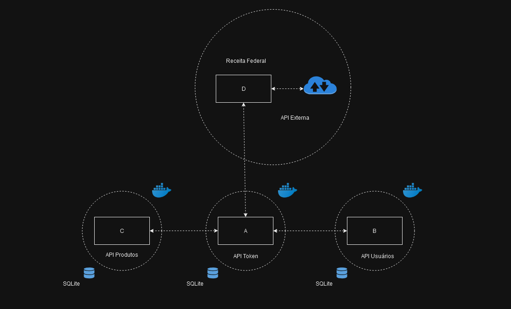

# API de Gerenciamento de Usuários com JWT e Flask

Este projeto é uma API RESTful para gerenciar usuários, com autenticação baseada em tokens JWT. A API foi construída utilizando **Flask**, **Flask-RESTful**, **Flask-JWT-Extended**, e **Flask-OpenAPI**. A aplicação permite o registro, login, e gerenciamento de usuários, com segurança e autenticação via JWT.

#### Descrição Geral

O sistema foi desenvolvido para gerenciar contas de usuários, permitindo:

- Registro e login de novos usuários.
- Listagem de usuários cadastrados.
- Atualização e exclusão de contas de usuários.
- Verificação de credenciais de usuários.

#### Funcionalidades Principais

1. **Autenticação JWT**: Geração e verificação de tokens JWT para acessar rotas protegidas.
2. **Gerenciamento de Usuários**: Registro, login, listagem, atualização e exclusão de contas.
3. **Proteção de Rotas**: As rotas que manipulam dados sensíveis estão protegidas por JWT, garantindo a segurança do sistema.

---

## Requisitos

Crie um ambiente virtual para instalar as dependências do projeto:

Windows:
```
python -m venv venv
```
macOS e Linux:
```
python3 -m venv venv
```

Ative o ambiente virtual:

Windows:
```
venv\Scripts\activate
```
macOS e Linux:
```
source venv/bin/activate
```

Instale as dependências do projeto:

```
pip install -r requirements.txt
```

Não esqueça de fazer um arquivo `.env` na pasta raiz.

---

## Funcionalidades

### Configuração do CORS

O CORS (Cross-Origin Resource Sharing) foi habilitado para controlar quais origens podem fazer requisições à API, garantindo maior segurança.

#### 1. `CORS(app, resources={...})`

- Habilita o CORS no aplicativo Flask, controlando quais origens podem acessar a API.

#### 2. `r"/api/*"`

- A configuração se aplica a todas as rotas que começam com `/api/`.

#### 3. `"origins": "http://127.0.0.1:5000"`

- Somente a origem `http://127.0.0.1:5000` (geralmente o frontend local) está autorizada a acessar a API. Qualquer outra origem será bloqueada.

Essa configuração garante que apenas o frontend autorizado possa interagir com a API, prevenindo acessos não autorizados.

Trecho de código:

```python
CORS(app, resources={r"/api/*": {"origins": "http://127.0.0.1:5000"}})
```

---

## Endpoints

### 1. **Home**
- **Rota:** `/`
- **Método:** `GET`
- **Descrição:** Redireciona para a documentação Swagger da API.
- **Resposta:**
  - `302`: Redireciona para `/openapi/swagger`

---

### 2. **Listar Usuários**
- **Rota:** `/api/usuarios`
- **Método:** `GET`
- **Descrição:** Retorna uma lista de todos os usuários cadastrados. Esta rota está protegida por JWT.
- **Autenticação:** Token JWT obrigatório.
- **Segurança:** `Bearer Token`
- **Respostas:**
  - `200`: Lista de usuários retornada com sucesso.
  - `400`: Erro de requisição.
  - `401`: Acesso não autorizado.
  - `500`: Erro interno no servidor.

---

### 3. **Registrar Usuário**
- **Rota:** `/api/registrar`
- **Método:** `POST`
- **Descrição:** Registra um novo usuário no sistema.
- **Autenticação:** Não requer autenticação.
- **Corpo da Requisição:**
  - `nome` (string) - Nome do usuário.
  - `email` (string) - Email do usuário.
  - `senha` (string) - Senha do usuário.
- **Respostas:**
  - `201`: Usuário registrado com sucesso.
  - `400`: Erro de validação de dados.
  - `500`: Erro interno no servidor.

---

### 4. **Atualizar Usuário**
- **Rota:** `/api/usuario/<int:id>`
- **Método:** `PUT`
- **Descrição:** Atualiza as informações de um usuário existente.
- **Autenticação:** Token JWT obrigatório.
- **Segurança:** `Bearer Token`
- **Parâmetros da Rota:**
  - `id` (int) - ID do usuário.
- **Corpo da Requisição:**
  - `email` (string) - Novo email do usuário (opcional).
  - `senha` (string) - Nova senha do usuário (opcional).
- **Respostas:**
  - `200`: Usuário atualizado com sucesso.
  - `400`: Erro de validação de dados.
  - `404`: Usuário não encontrado.
  - `500`: Erro interno no servidor.

---

### 5. **Deletar Usuário**
- **Rota:** `/api/usuario/<int:id>`
- **Método:** `DELETE`
- **Descrição:** Remove um usuário do sistema pelo seu ID.
- **Autenticação:** Token JWT obrigatório.
- **Segurança:** `Bearer Token`
- **Parâmetros da Rota:**
  - `id` (int) - ID do usuário.
- **Respostas:**
  - `204`: Usuário removido com sucesso.
  - `404`: Usuário não encontrado.
  - `500`: Erro interno no servidor.

---

### 6. **Verificar Credenciais**
- **Rota:** `/api/verifica_senha`
- **Método:** `POST`
- **Descrição:** Verifica se o email e senha do usuário estão corretos.
- **Autenticação:** Não requer autenticação.
- **Corpo da Requisição:**
  - `email` (string) - Email do usuário.
  - `senha` (string) - Senha do usuário.
- **Respostas:**
  - `200`: Credenciais verificadas com sucesso.
  - `400`: Erro de validação de dados.
  - `401`: Credenciais inválidas.
  - `500`: Erro interno no servidor.

---

## Erros Comuns

- `400` - Erro de Requisição: Quando os dados fornecidos na requisição são inválidos.
- `401` - Não Autorizado: Quando o token JWT está ausente ou inválido.
- `404` - Não Encontrado: Quando o recurso solicitado não existe.
- `500` - Erro Interno do Servidor: Problemas ao processar a requisição no servidor.

---

## Executando o Projeto

Para iniciar o servidor de desenvolvimento, execute:

```
python app.py
```

---

# Docker

 ### 1. Criar a rede manualmente:
Você pode criar a rede antes de subir os containers usando o comando abaixo:

```bash
docker network create my_custom_network
```

### 2. Definir os containers no `docker-compose.yml`:

Depois, no arquivo `docker-compose.yml`, associe os containers a essa rede criada:

```yaml
version: '3'
services:
  flask-1:
    image: docker-1-flask-app-service
    container_name: flask-1
    ports:
      - "5001:5000"
    networks:
      - my_custom_network

  flask-2:
    image: docker-2-flask-app-service
    container_name: flask-2
    ports:
      - "5002:5000"
    networks:
      - my_custom_network

  flask-3:
    image: docker-3-flask-app-service
    container_name: flask-3
    ports:
      - "5003:5000"
    networks:
      - my_custom_network

networks:
  my_custom_network:
    external: true
```

### Explicação:
- **`networks`:** Aqui estamos indicando que a rede `my_custom_network` já existe (`external: true`), ou seja, ela foi criada previamente e não será gerada automaticamente pelo Docker Compose.

### 3. Subir os containers:
Com a rede criada, você pode subir os containers normalmente:

```bash
docker-compose up -d
```

### Verificar os containers na rede:
Você pode verificar se os containers estão corretamente conectados à rede com o seguinte comando:

```bash
docker network inspect my_custom_network
```

Dessa forma, você cria uma rede separada e coloca os containers dentro dela para que possam se comunicar.

# Estrutura


